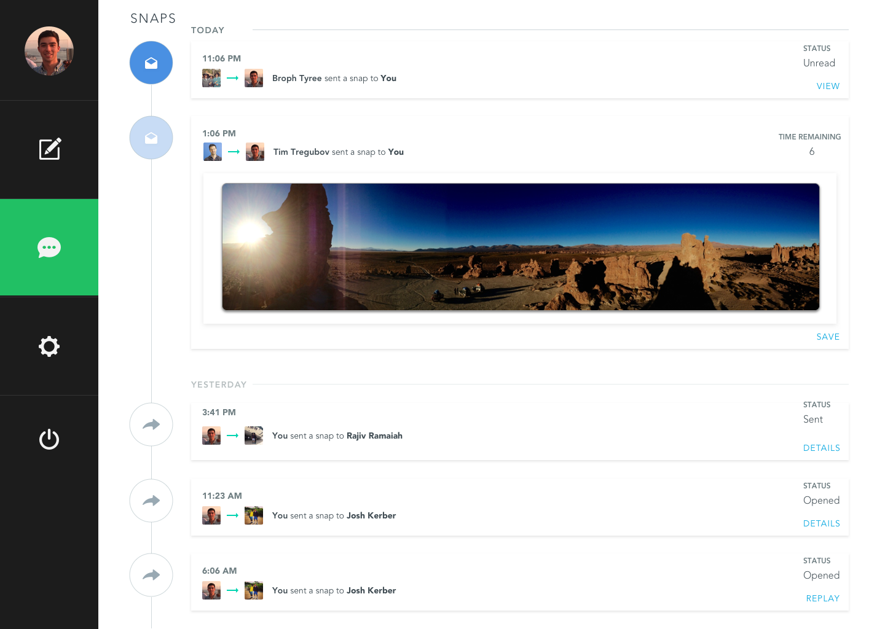

# Project Name

SnapApp is a web application that will allow users to send pictures and text to other users that will disappear after they are seen by the receiving user. Think of Snapchat but in your web browser, allowing you to communicate with your friends and family from your computer whenever it is open and in front of you instead of having to get your phone out, unlock it, and search for Snapchat to get the job done. SnapApp supports groups, so you can send messages to a group of pre-selected people so you don't have to constantly search for the people you want to send pictures to.

Console:

Users will see all of their incoming snaps and activity on this main page which they reach after logging in or signing up. They can then click on the icons on the left to create a new Snap to send to people, to manage their account settings, and to log out of SnapApp!

## Architecture

For the Front End of our application, we have decided to use React and Redux to manage our data and display it to the user accordingly. This means that we can use action, reducers, the redux store, and other built in libraries to accurately display and update the pictures a user receives. To authenticate users of SnapApp, we will be using Passport.js to make JSON Web Tokens for our application and for users.

For the Back End of our application, we are going to use a Node app running Express.js and using Mongoose to interact with a MongoDB database hosted on Heroku or AWS to store our data. This will allow us to persist data from the database and store various data types like photos, strings, identification numbers and more.

## Setup

To setup the project `git clone` the SnapApp-Frontend and SnapApp-Backend repositories from the Dartmouth-CS52 github account. Then when you `cd` to each repository in your terminal, follow the next directions:

`npm install`

Running this will install all the node modules and libraries that you need to compile and run the application on your end and to test that it works.

For the SnapApp-Frontend repository run:

`npm start`

This will allow you to test the project locally on your own localhost.

For the SnapApp-Backend repository run the following in a different terminal window:

`npm run dev`

This will start the backend server at your own local host to test.

## Deployment

Currently we are going to test the project locally before we host the Backend on Heroku or AWS. In order to start the backend, ensure that you have MongoDB set up correctly on your computer. You should have a data/db directory at the root of your computer as MongoDB requires this. Navigate to the directory for the SnapApp-Backend and run `npm run dev` which will start the server at the localhost:9090 for the front end of your application to communicate with. You will also need to run `mongod &` in another terminal window at the root of your computer for the app to connect to.

Ensure that the SnapApp-Frontend points to the correct localhost port. Now, navigate to the SnapApp-Frontend directory and run `npm start` to launch the project running on a local host. Navigate to that local host path in your Chrome browser and begin testing.

## Authors

Rajiv Ramaiah, Chris Davis, Zuff Idries, Josh Kerber, Brophy Tyree

## Acknowledgments
[The HW5 Part 1 instruction guide](http://cs52.me/assignments/hw5p1/)
